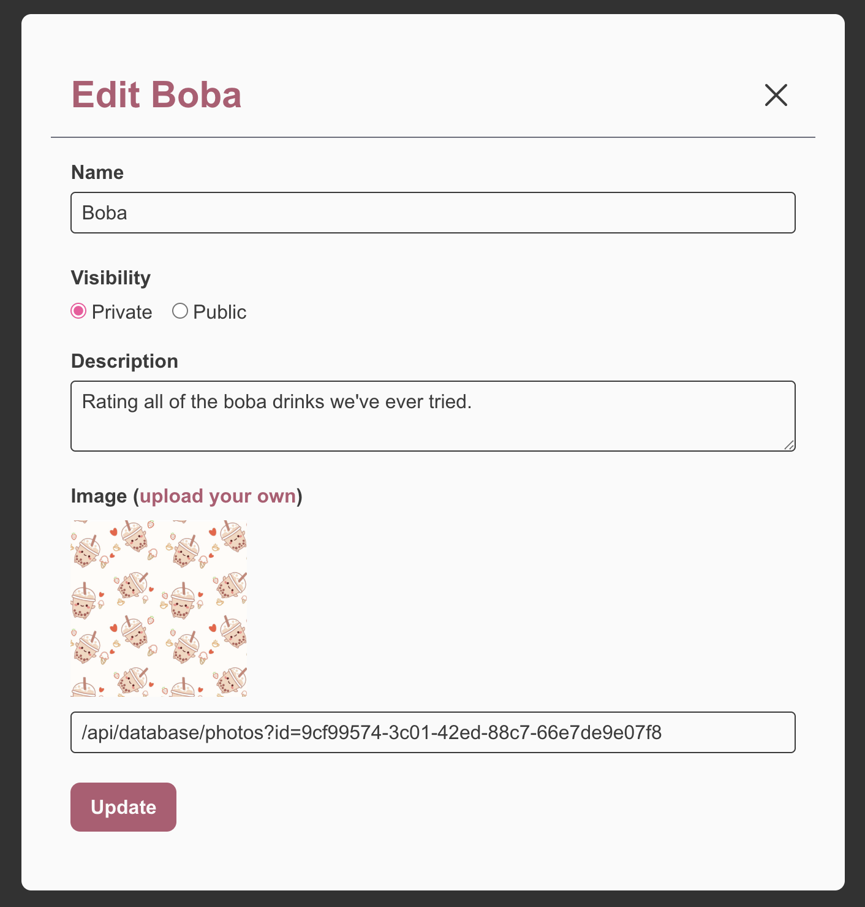
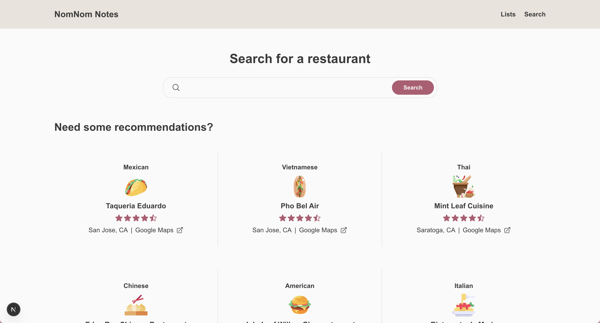

# NomNom Notes

This full-stack web application enables users to create and manage personalized restaurant lists, add reviews for restaurants they’ve visited, and visualize their lists on an interactive map. Users can search for restaurants using the Google Places API and add them to specific lists. Each restaurant entry allows users to log dishes with custom fields for the dish name, reviews, and an image. Users can also collaborate on lists by inviting others to contribute their own reviews of restaurants and dishes. In addition, users have publicly shareable profiles that highlight key statistics and showcase their photos, lists, restaurants, and reviews.

## Features

### Account features
* User can create an account and sign in
* User will need an access code to create an account

### Profile features
* Every user has a profile that they can set to private or public
* The profile will show the user's key statistics (number of lists, restaurants saved, and dishes reviewed)
* The profile will highlight the user's 4 most recently updated lists
* The profile will highlight the user's 4 most recently saved restaurants
* The profile will highlight the user's 4 most recently reviewed dishes

### List features
* User can create, edit, and delete lists
* User can add an image for their list
* User can add a description for their list
* User can sort the restaurants in each list by "Recently added" or by "Name"
* User can remove restaurants from their list
* User can set the list visibility to private or public

### Search features
* User can search for restaurants by name
* User can see basic restaurant details (name, restaurant type, address, cover photo)
* User can view the restaurant in Google Maps
* User can choose what list to save the restaurant to
* User can only submit 100 new search queries per 24 hours

### Restaurant features
* User can add a review for each restaurant
* User can create, edit, and delete dishes for each restaurant
* User can add an image for their dish
* User can add a review for each dish

### Map features
* An interactive map will show the locations of the restaurants in each list
* User can only load the map 250 times per 24 hours

### Collaboration features
* User can choose to share their lists with other registered users
* Collaborators can add and remove restaurants and dishes in the list
* Collaborators can add their own reviews for all restaurants and dishes in the list

## Tech Stack

**Frontend:** React, Next.js, Tailwind CSS

**Backend:** Node.js, MongoDB, Cloudfare R2 Storage, Better Auth

**APIs:** Google Places API, Google Photos API, Google Maps JavaScript API

**Testing:** Vitest, Cypress

**CI/CD:** GitHub Actions

**Hosting platform:** Vercel

## Screenshots

A page where users can sign up for an account.

A page where users can sign in to their account.

The navigation bar has two icons: one for lists and one for profile. The lists icon will take the user to their lists. The profile icon will show a submenu where the user can view their profile, go to their account settings, or sign out.

A profile page that shows the user's basic information, key statistics, photos, lists, restaurants, and reviews. The user can edit their profile by clicking the "Edit profile" button, that will only appear for them, in the hero.

A page where the user can change their settings. In the "Profile" tab, they can change their display name, location, and avatar photo. In the "Email" tab, they can change their email. In the "Password" tab, they can change their password. In the "Privacy" tab, they can set their profile to private or public. 

A page showing all of the custom lists that the user has created or is a collaborator of. The user can drag-and-drop each list to change the order of how they appear. The user can also create a new list by clicking on the gray tile with the plus icon. This page can also be accessed by clicking on the bookmark icon in the navigation.

A pop-up modal that allows the user to make edits to a specific list. When the visibility is set to private, only the list owner and collaborators can view the list. When the visibility is set to public, anybody with the list link can view the list. The user can choose an image file to upload. An image preview will appear for the image file uploaded.

The owner of the list can choose to share their list with other registered users. They can share via a unique link that will be generated when the "Copy invitation link" button is clicked. They can also view who is currently has access to the list. They can remove existing collaborators on the list by clicking the "X" button.

A page where a user is being invited to collaborate on a list. 

The default search page where a user can search for specific restaurants by entering the name into the input bar.

The search page results where related results will appear (maximum of 20), and the user can select on which one to add to their list. The user can also click on the "Google Maps" link to view it there. 

A page for each custom list with the restaurants that were saved into the list. The user can sort the list by "Recently added" or by "Name". The user can edit restaurant description and ratings, or delete them from the list. All of the restaurants' locations on the list are added to an interactive map that the user can scroll and click around.

A page for each restaurant with the dishes that were added. The user can drag-and-drop each dish to change the order of how they appear. The user can also create a new dish by clicking on the gray tile with the plus icon.

A pop-up modal that allows the user to add a dish to a specific restaurant. The user cannot add the dish until all required fields are filled out. If no image is provided, a default placeholder image will be used.

A pop-up modal that shows all of the reviews for a restaurant or dish.

## Future improvements
* **Database:** Cron job to periodically clean up unused data in the database