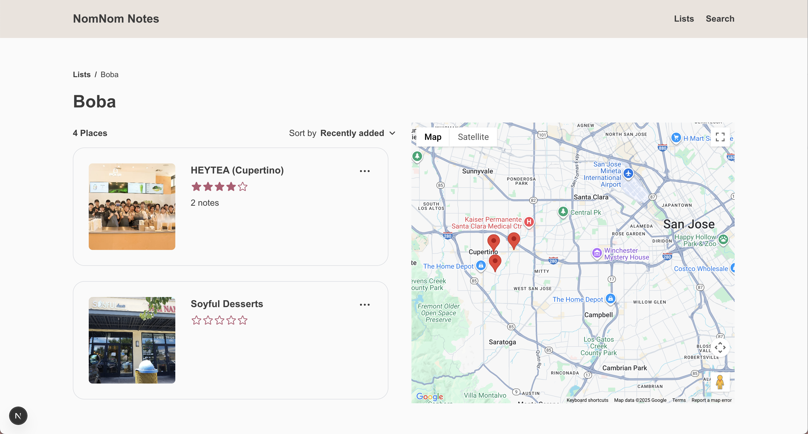
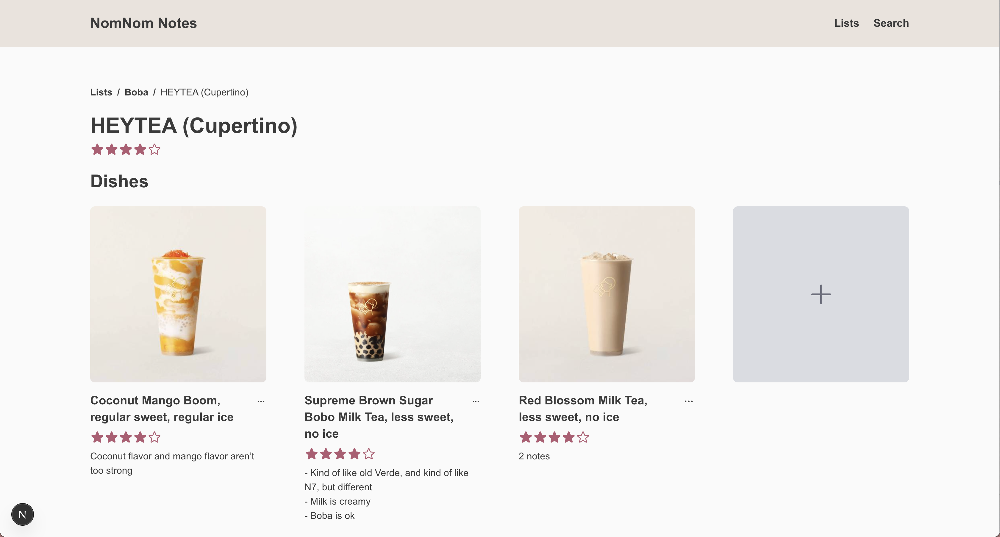

# NomNom Notes

This full-stack web application enables users to create and manage personalized restaurant lists, add descriptions and ratings for restaurants they've visited, and visualize their lists on an interactive map. Users can search for restaurants using the Google Places API and add them to specific lists. Each restaurant entry allows users to log dishes with custom fields for the dish name, rating, notes, and an optional image upload. All data is stored and managed in a MongoDB database.

## Features

### List features
* User can create, edit, and delete lists
* User can add an image (by URL link or file upload) for their list
* User can add a description for their list
* User can sort the restaurants in each list by "Recently added" or by "Name"
* User can remove restaurants from their list

### Search features
* User can search for restaurants by name
* User can see basic restaurant details (name, restaurant type, address, cover photo)
* User can view the restaurant in Google Maps
* User can choose what list to save the restaurant to

### Restaurant features
* User can rate and add a description for each restaurant
* User can create, edit, and delete dishes for each restaurant
* User can add an image (by URL link or file upload) for their dish
* User can rate and add a description for each dish

### Map features
* An interactive map will show the locations of the restaurants in each list

## Tech Stack

**Frontend:** React, Next.js, Tailwind CSS

**Backend:** Node.js, MongoDB

**APIs:** Google Places API, Google Photos API, Google Maps JavaScript API

## Screenshots

A page showing all of the custom lists that the user has created. The user can drag-and-drop each list to change the order of how they appear. The user can also create a new list by clicking on the gray tile with the plus icon. This page can also be accessed by clicking on "Lists" in the sidebar.

A search page where a user can search for specific restaurants by entering the name into the input bar. Related results will appear (maximum of 20), and the user can select on which one to add to their list. The user can also click on the "Google Maps" link to view it there. This page can also be accessed by clicking on "Search" in the sidebar.

A pop-up modal that allows the user to make edits to a specific list. The user can choose to use an external image URL or upload their own image file. If the user chooses to use an external image URL, it will be checked if the image is valid before allowing the user to use it. An image preview will appear for any image URL added or image file uploaded.

A page for each custom list with the restaurants that were saved into the list. The user can sort the list by "Recently added" or by "Name". The user can edit restaurant description and ratings, or delete them from the list. All of the restaurants' locations on the list are added to an interactive map that the user can scroll and click around.

A page for each restaurant with the dishes that were added. The user can drag-and-drop each dish to change the order of how they appear. The user can also create a new dish by clicking on the gray tile with the plus icon.

A pop-up modal that allows the user to add a dish to a specific restaurant. Only the name is a required field. To set a rating, the user can hover over the stars and click on the rating they would like to give (by half-star increments). If no image is provided, a default placeholder image will be used.

## Future improvements
* **Responsive design:** Make the web application dynamically adapt to various screen sizes and devices for optimal user experience and accessibility. 
* **Host the site:** Deploy the web application to make it publicly accessible in a live environment.
* **User authentication:** User can create a profile and log in. Search rates will also be limited per account.
* **List collaboration:** User can collaborate on lists with other users on the platform.